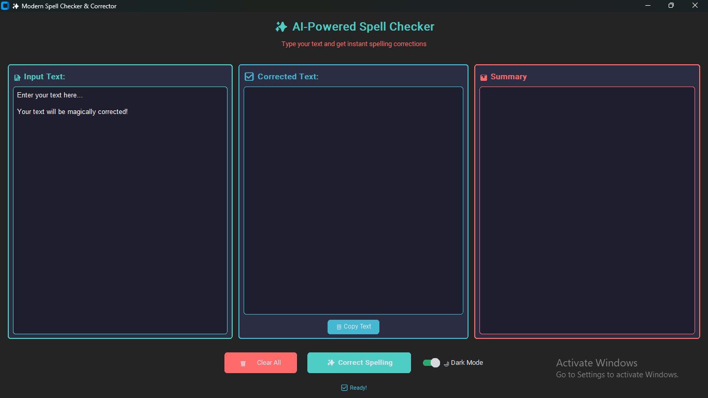
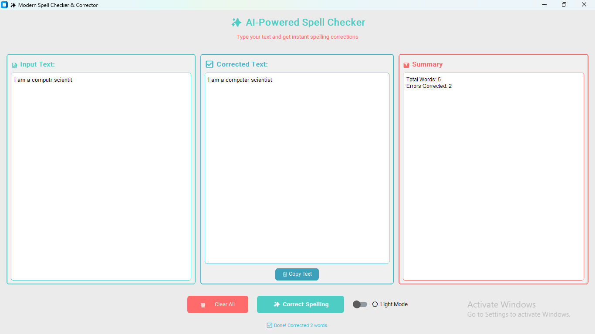

# ✨ Modern AI-Powered Spell Checker & Corrector

## 📖 Table of Contents
* [Project Overview](#-project-overview)
* [AI & NLP Logic](#-ai--nlp-logic)
* [Key Features](#-key-features)
* [Technical Stack](#%EF%B8%8F-technical-stack)
* [Data Preview](#%EF%B8%8F-data-preview)
* [Installation & Setup](#%EF%B8%8F-installation--setup)
* [Usage Guide](#-usage-guide)

---

## 📌 Project Overview
This project is a high-performance desktop application designed to detect and correct spelling errors in real-time. By leveraging **Natural Language Processing (NLP)**, the system analyzes text input and provides the most linguistically accurate corrections, all within a sleek, modern interface. It is built to bridge the gap between complex AI logic and a user-friendly experience.

---

## 🧠 AI & NLP Logic
The application uses the **TextBlob** library, which is built on top of NLTK (Natural Language Toolkit). 
* **Pattern Recognition:** The AI identifies words that do not match its internal dictionary.
* **Correction Algorithm:** It uses a probabilistic approach to find the most likely intended word based on the context and character distance.
* **Text Analysis:** The system tokenizes the input text, processes each word, and provides a summary of the total word count versus corrected errors.

---

## 🚀 Key Features
* **Modern UI/UX:** Built with `customtkinter` for a polished, "Windows 11" style aesthetic.
* **Dual Themes:** Includes a dynamic **Dark Mode** and **Light Mode** toggle to suit user preference.
* **One-Click Actions:** * **Paste:** Directly pull text from your clipboard.
    * **Copy:** Quickly save the corrected text back to your clipboard.
    * **Clear:** Instantly reset the workspace for a new task.
* **Correction Summary:** A dedicated panel that tells you exactly how many errors were fixed.
* **Responsive Design:** The window logic automatically scales based on the user's screen resolution.

---

## 🏗️ Technical Stack
* **Language:** Python 3.x
* **GUI Library:** `customtkinter` (Modernized Tkinter components)
* **NLP Engine:** `TextBlob` (Linguistic processing)
* **Utilities:** `pyperclip` (Clipboard management), `re` (Regular expressions for text cleaning)

---

## 🖼️ Data Preview

### Dark Mode Interface
*The primary workspace featuring the sleek dark theme and green accent colors.*


### Light Mode & Correction Summary
*Demonstrating the light theme and the AI's breakdown of corrected words.*


---

## 🛠️ Installation & Setup

Follow these steps to get the application running on your system:

1. **Clone the Repository:**
   ```bash
   git clone [https://github.com/eshek2020/modern-spell-checker.git](https://github.com/eshek2020/modern-spell-checker.git)
   cd modern-spell-checker
2. **Install Dependencies:**
   The project requires the libraries listed in the requirements.txt file.
   pip install -r requirements.txt
3. **Run the Application:**
   python modern_spellchecker.py

---

## 🤝 How to Use

**Input:** Type or paste your text into the "Input Text" box.

**Correct:** Click the "✨ Correct Text" button.

**Review:** See the corrected version in the output box and check the "Correction Summary" at the bottom for statistics.

**Export:** Click "Copy to Clipboard" to use the corrected text in another application.
